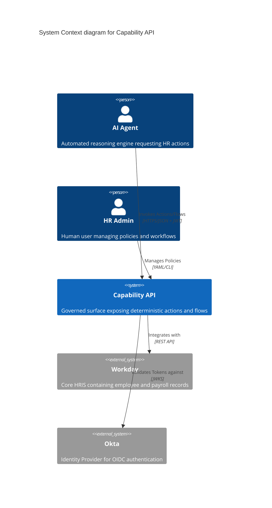
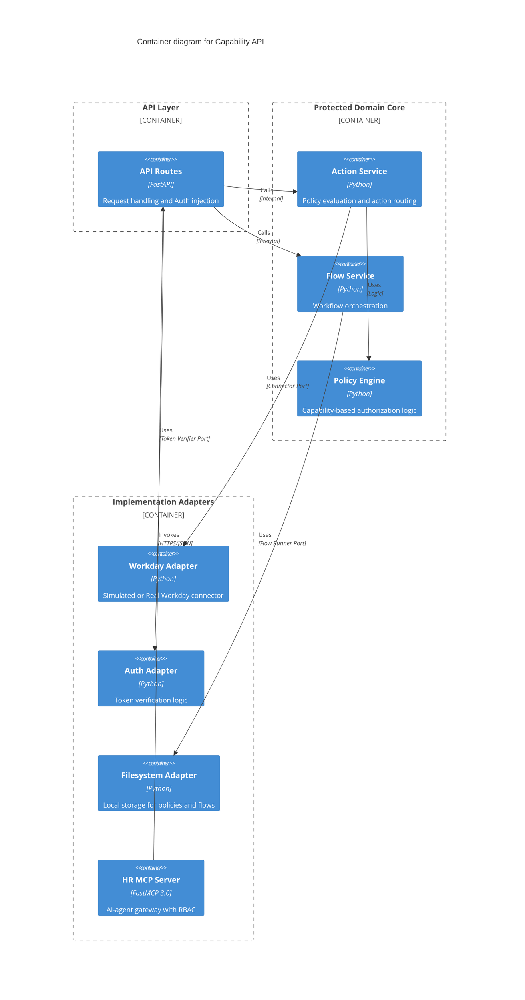

# Architectural Guide: Capability API

This document provides a high-level overview of the HR AI Platform's Capability API system design.

## System Context (C4 Level 1)

The Capability API serves as the central orchestration layer between AI Agents/HR Applications and external HR systems like Workday.

## Containers (C4 Level 2)

The system follows a **Hexagonal Architecture** (Ports and Adapters) to ensure the core business logic remains isolated from infrastructure concerns.

## Port & Adapter Mappings

| Port (Interface) | Adapter (Implementation) | Purpose |
|------------------|--------------------------|---------|
| `ConnectorPort` | `WorkdaySimulator` | External HR system integration |
| `FlowRunnerPort` | `LocalFlowRunnerAdapter` | Long-running process execution |
| `PolicyLoaderPort`| `FilePolicyLoaderAdapter`| Policy document persistence |
| `TokenVerifier` | `MockTokenVerifier` | Identity validation |

## Module Documentation

For detailed information on specific system components, refer to the following module guides:

- **[API Layer](modules/api_layer.md)**: Entry points, routing, and dependencies.
- **[Domain Entities](modules/domain_entities.md)**: Core data models and audit protocols.
- **[Auth Adapter](modules/auth_adapter.md)**: OIDC simulation and token verification.
- **[Workday Simulator](modules/workday_adapter.md)**: Simulated HRIS implementation (HCM, Time, Payroll).
- **[Filesystem Adapter](modules/filesystem_adapter.md)**: Policy loading and flow execution.

## Core Principles
1. **The Sanctuary**: The `domain/` directory MUST NOT import from `adapters/` or `api/`.
2. **Deterministic Actions**: All actions must have explicit Pydantic schemas and predictable outcomes.
3. **Audit by Design**: Every operation generates provenance metadata tracked via the `ActionResponse`.
