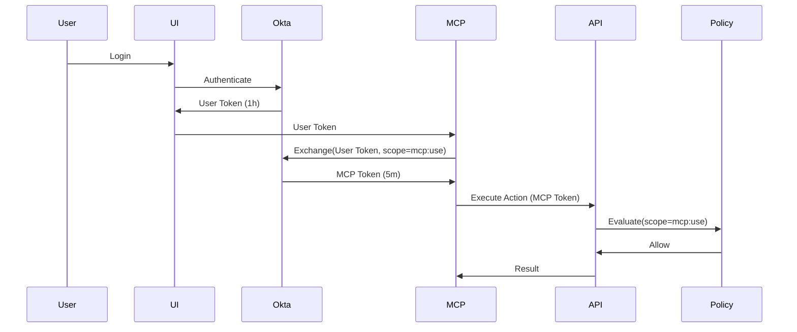

# OAuth 2.0 Token Exchange & Scoping

This module implements RFC 8693 Token Exchange to improve security by reducing the "blast radius" of tokens used by the MCP Server.

## Overview

The MCP Server acts as an intermediary between the User (via Chainlit/UI) and the Capability API. Instead of holding the user's long-lived (1 hour) full-access token, the MCP Server exchanges it for a short-lived (5 minute) scoped token (`mcp:use`).

## Security Benefits

1.  **Blast Radius Reduction**: MCP-held tokens expire in 5 minutes.
2.  **Scope Isolation**: Tokens with `mcp:use` scope cannot be used to call the Capability API directly (unless `acting_as` claim is present and validated, effectively binding it to the MCP server context).
3.  **Provenance**: Audit logs show `acting_through: mcp-server` and link back to the original user token via `original_token_id`.
4.  **Freshness**: Sensitive actions (e.g., payroll) enforce `max_auth_age_seconds` (Step-Up Auth).

## Architecture

### Token Flow



### Policy Configuration

New conditions available in `policy-*.yaml`:

```yaml
conditions:
  required_scope: "mcp:use"       # Enforce specific scope
  max_auth_age_seconds: 300       # Enforce recent authentication
```

## Testing

Run the demo script:
```bash
./scripts/demo/token_exchange_demo.sh
```
