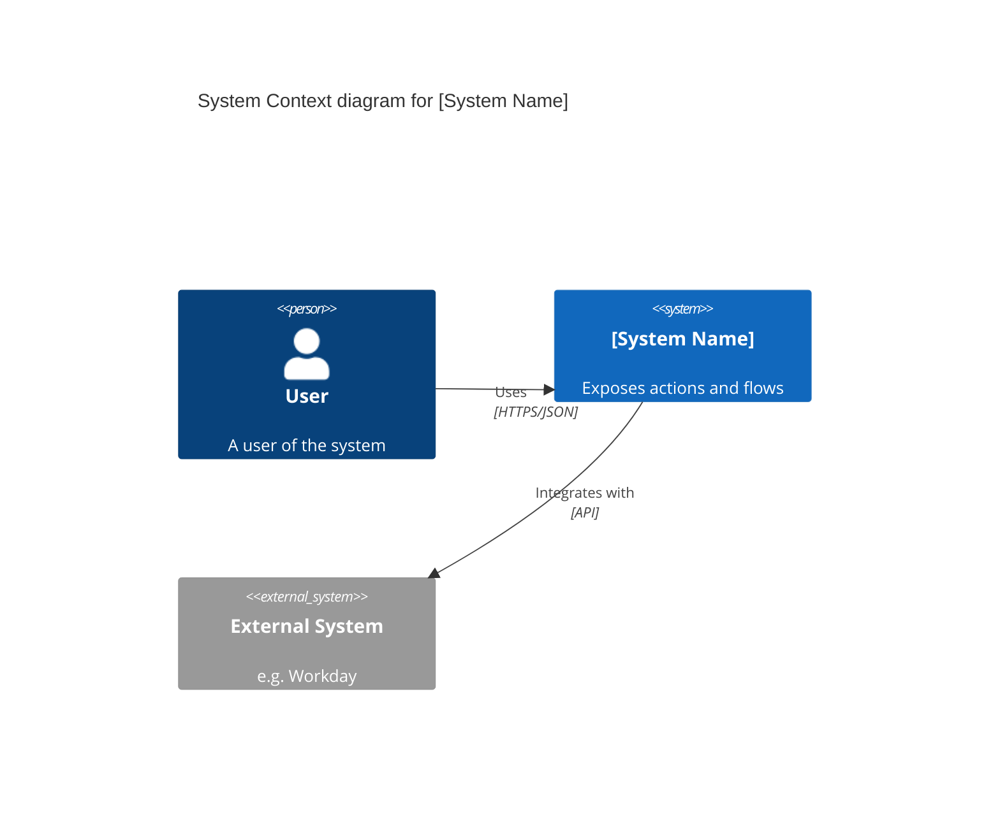
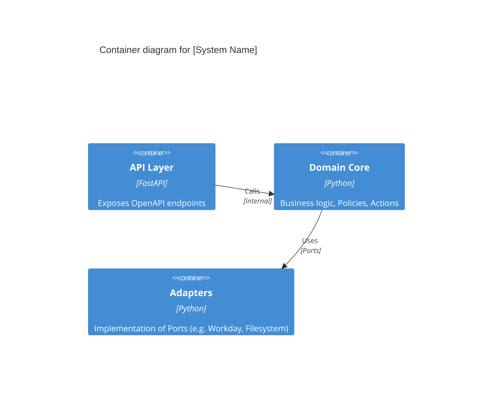

# Architectural Guide: [System Name]

## System Context
[High-level overview]

```mermaid
C4Context
  title System Context diagram for [System Name]
  Person(user, "User", "A user of the system")
  System(system, "[System Name]", "Exposes actions and flows")
  System_Ext(ext_system, "External System", "e.g. Workday")

  Rel(user, system, "Uses", "HTTPS/JSON")
  Rel(system, ext_system, "Integrates with", "API")
```

## Containers
[Description of major containers/modules]

```mermaid
C4Container
  title Container diagram for [System Name]
  
  Container(api, "API Layer", "FastAPI", "Exposes OpenAPI endpoints")
  Container(core, "Domain Core", "Python", "Business logic, Policies, Actions")
  Container(adapters, "Adapters", "Python", "Implementation of Ports (e.g. Workday, Filesystem)")

  Rel(api, core, "Calls", "Internal")
  Rel(core, adapters, "Uses", "Ports")
```
