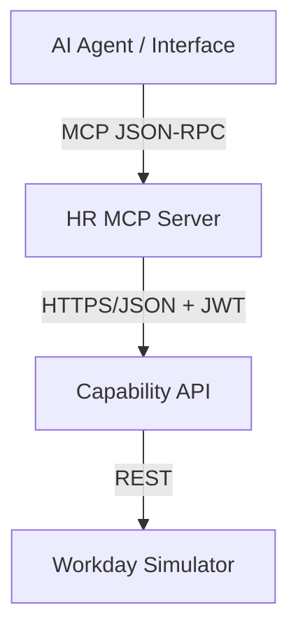

# Architecture Guide: HR MCP Server

This document describes the internal design and system integration of the HR MCP Server.

## System Position

The MCP Server sits between the AI Agent Interface (e.g., Chainlit, Claude Desktop) and the core Capability API.



## Internal Containers

The module follows a simplified Hexagonal architecture:

- **Entry Point**: `server.py` handles the FastMCP lifecycle and tool registration.
- **Tools (Domain)**: Logic for HCM, Time, and Payroll tools. They orchestrate auth and backend calls.
- **Adapters (Infrastructure)**: 
    - `auth.py`: Logic for extracting and inspecting OIDC tokens.
    - `backend.py`: Async HTTP client for the Capability API.
- **Models**: Pydantic schemas representing the data contract.
- **Lib**: Shared cross-cutting concerns (Logging, Config, Errors).

## Sequence Diagram: Tool Execution

```mermaid
sequence_sequence
    participant C as Client
    participant M as MCP Server
    participant A as Auth Adapter
    participant B as Backend Client
    participant API as Capability API

    C->>M: Call Tool (params, context)
    M->>A: authenticate_and_authorize(ctx, tool)
    A->>A: Extract & Decode Token
    A->>A: Check RBAC Mapping
    A-->>M: (token, principal, error)
    
    alt Unauthorized
        M-->>C: ERROR: Forbidden/Unauthorized
    else Authorized
        M->>B: call_action(domain, action, params, token)
        B->>API: POST /actions/{domain}/{action}
        API-->>B: JSON Result
        B-->>M: Data
        M->>M: Audit Log (Masked)
        M-->>C: Tool Result String
    end
```

## Design Decisions

### 1. Stateless Passthrough
The MCP server does not maintain its own database of employees or policies. It extracts the OIDC token from the client and passes it to the Capability API. This ensures that the **Capability API remain the single source of truth** for authorization and data.

### 2. Double-Layer RBAC
While the backend enforces strict policies, the MCP server performs a "pre-flight" check. This allows for:
- **Dynamic Tool Listing**: AI Agents only see tools they are allowed to use.
- **Immediate Rejection**: Faster feedback loop for unauthorized attempts.

### 3. PII Masking at the Edge
Following Constitution Article VIII, all logs generated by the MCP server are masked before they touch the disk. This prevents PII from leaking into infrastructure logs even if the backend returns sensitive data.
